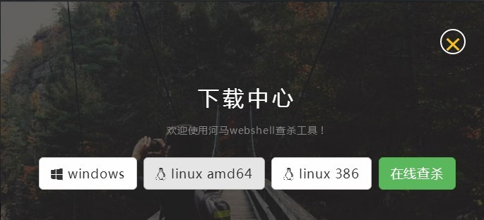
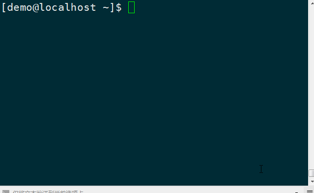

#河马 webshell扫描器 for Linux 使用手册

[首页](http://www.webshell.pub)                 
[在线查杀](http://n.webshell.pub)

本教程适用于linux服务器环境的安装使用;[windows版本教程查看这里](http://www.webshell.pub/doc/hm_win_usage.html)

##安装使用

1. 下载

	访问<http://www.webshell.pub>官方网站

	点击【立即使用】进入下载中心

	
	
	选择适合您的版本

	linux 64位选择 linux amd64
	linux 32位选择 linux 386

	可以使用wget进行下载，在按钮上【鼠标右键】->【复制链接地址】
	
	下载64位版本
	wget http://www.webshell.pub/download/hm/1.2.0/hm-linux-amd64.tgz

	下载32位版本
	wget http://www.webshell.pub/download/hm/1.2.0/hm-linux-386.tgz

	以上路径会随着版本更新而变化，请从下载中心获取最新版本

	河马webshell查杀推荐您使用XShell作为ssh客户端，XShell有面向个人学校、教育的免费版本
	
2. 解压缩
	
	linux压缩包格式是tgz格式的，使用tar gz解压缩
	以64位程序为例

	tar xvf hm-linux-amd64.tgz
		
	**注意:**  
	**不要将本软件放置到web目录下**  
	**不要在web目录下运行软件**
	
3. 配置环境变量（非必须）
	
	有两种可选的方法
	3.1 创建软连接
	sudo ln -s hm程序全路径 /usr/bin/hm
	

	3.2 设置环境变量
	将河马webshell查杀工具路径添加到`PATH`环境变量

	配置环境变量可以让您在命令行下直接输入程序名来使用；如果没有配置环境变量则需要输入程序的完整路径或者在程序所在目录下使用`./`+命令

	参考:[在Linux里设置用户环境变量的方法](http://blog.csdn.net/yumushui/article/details/39290749)

4. 使用

	
	
	4.1 查看帮助
		
		hm -h

	4.2 查看版本

		hm version

	4.3 扫描后门

		hm scan 你的web目录

		扫描完成之后结果会保存为result.csv文件，使用记事本或者excel打开查看

	4.4 升级

		hm update	

5. FAQ

	5.1 无法连接到云服务

		本产品采用本地+云端双引擎，需要联网之后才能准确查杀；请检查您的网络是否能访问云服务，可以在浏览器中输入http://api.webshell.pub/进行测试

	5.2 bash: hm: command not found

		您为将`hm`加入到系统环境变量中，请参考步骤【3. 配置环境变量】一节，也可以输入hm的全路径进行使用

##Tips

1. 为什么不能在web目录下使用本软件

	本软件扫描完成之后会在运行的工作目录下生成扫描结果；如果在web目录下生成结果，则会被黑客下载，黑客就可以通过您服务器上已有后门获取服务器权限。

2. 为什么扫描速度很慢

	正常的扫描速度大约是每秒钟200~300个文件如果远慢于这个速度则可能有异常。1.请检查您的网络是否正常，本软件扫描时需要连接到云查杀引擎；2.可能被杀毒软件拦截，请将本软件的路径添加到杀毒软件白名单中
	
3. 如何查看我的系统是32位的还是64位的

	如果您使用的linux系统但不确定是32位的还是64位的可以使用以下命令`arch`来查看
		
		x86_64 就是64位系统，请点击下载linux amd64
		x86 就是32位系统，请点击linux 386

	如果您的linux系统没有安装arch，可以使用`uname -r`命令来查看

##联系我们

如果您在使用过程中遇到了困难，或者有好的建议反馈给我们。可以通过以下方式联系我们：
	
   QQ:1494922137  
   <webshell.pub@gmail.com>