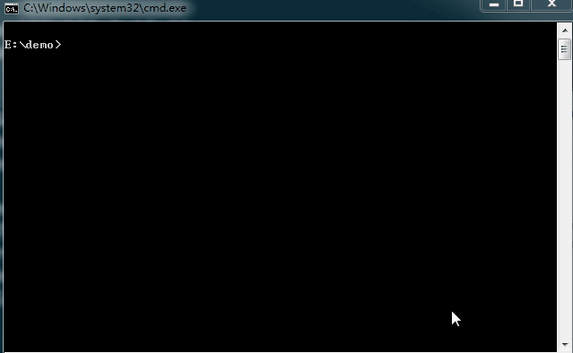

#河马 webshell扫描器 for windows 使用手册

[首页](http://www.webshell.pub)                 
[在线查杀](http://n.webshell.pub)

本教程适用于windows服务器环境的安装使用;[linux版本教程查看这里](http://www.webshell.pub/doc/hm_linux_usage.html)

##安装使用

1. 下载

	访问<http://www.webshell.pub>官方网站

	点击【立即使用】进入下载中心

	
	点击windows按钮[下载windows版本](http://www.webshell.pub/download/hm/1.2.0/hm-windows-386.zip)
	
2. 解压缩
	
	压缩包格式是zip格式的，使用winzip、winrar、[360压缩](http://yasuo.360.cn/)均可以解压缩
		

	**注意:**  
	**不要将本软件放置到web目录下**  
	**不要在web目录下运行软件**
	
3. 配置环境变量（非必须）

	将河马webshell查杀工具路径添加到`PATH`环境变量

	配置环境变量可以让您在命令行下直接输入程序名来使用；如果没有配置环境变量则需要输入程序的完整路径

	参考:[百度经验-如何配置环境变量](http://jingyan.baidu.com/article/3ea51489e1c2b752e61bbad0.html)
	

4. 使用

	**如果您的系统上使用了杀毒软件，请务必将本软件的路径添加到杀毒软件白名单中！**

	
	
	4.1 查看帮助
		
		hm -h

	4.2 查看版本

		hm version

	4.3 扫描后门

		hm scan 你的web目录

		扫描完成之后结果会保存为result.csv文件，使用记事本或者excel打开查看

	4.4 升级

		hm update
	

5. FAQ

	5.1 无法连接到云服务

		本产品采用本地+云端双引擎，需要联网之后才能准确查杀；请检查您的网络是否能访问云服务，可以在浏览器中输入http://api.webshell.pub/进行测试

	5.2 'hm' 不是内部或外部命令，也不是可运行的程序或批处理文件。

		您为将`hm.exe`加入到系统环境变量中，请参考步骤【3. 配置环境变量】一节，也可以输入hm.exe的全路径进行使用

##Tips

1. 为什么不能在web目录下使用本软件

	本软件扫描完成之后会在运行的工作目录下生成扫描结果；如果在web目录下生成结果，则会被黑客下载，黑客就可以通过您服务器上已有后门获取服务器权限。

2. 为什么扫描速度很慢

	正常的扫描速度大约是每秒钟200~300个文件如果远慢于这个速度则可能有异常。1.请检查您的网络是否正常，本软件扫描时需要连接到云查杀引擎；2.可能被杀毒软件拦截，请将本软件的路径添加到杀毒软件白名单中
	

##联系我们

如果您在使用过程中遇到了困难，或者有好的建议反馈给我们。可以通过以下方式联系我们：
	
   QQ:1494922137  
   <webshell.pub@gmail.com>