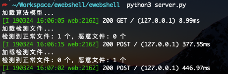

## webshell检测的Demo

胡乱捣鼓了下，计划是用Tornado和Django(ORM)，做成一个有前后端交互的系统，奈何事情太多，久久不动，就放置了一段时间（ 小声bibi：其实是太菜写不动了）🤣🤣🤣

默认使用随机森林算法生成加载模型，代码里面有多种算法模型。我测试下来的结果是随机森林算法准确率最高。

运行环境：python3 + Tornado + Django 

```
python3 server.py 
```

缺啥库就pip install就好,第一次运行要训练出模型文件。



