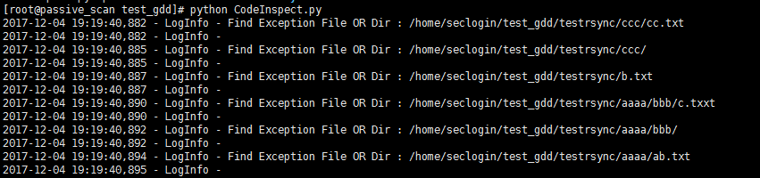

# CodeInspect 0.1

这个脚本的主要目标是根据代码发布的方式，从根本上实现WEBShell、网马或恶意链接等安全方面的检测。

## Author ##
咚咚呛 

如有其他建议，可联系微信280495355

## Support ##

满足如下安全需求

	1、周期内查询网站代码是否进行过修改如：添加、修改、删除等
	2、修改的文件进行日志告警、并进行提取备份
	3、事件发生时，可立即进行代码同步恢复，删掉添加或修改的内容。
	4、支持GIT、SVN、Rsync等代码发布服务

技术细节如下：

	1、支持多级代码目录形式
	2、支持GIT、SVN、Rsync等代码发布服务
	3、支持变动文件拷贝
	4、支持代码恢复功能

## Test Environment ##

>CentOS Linux release 7.3.1611 (Core)

## Tree ##

	PubilcAssetInfo
	----CodeInspect.py   #主程序
	

## Config ##

配置信息CodeInspect.py

	# 代码路径
	CODE_DIR_LIST = ['/root/tool/PubilcAssetInfo', '/home/seclogin/test_gdd/testbbb', '/home/seclogin/test_gdd/testrsync']
	# 代码同步方式 git / svn / rsync
	TYPE = 'rsync'
	# 是否执行代码恢复，True / False
	ACTION = True
	# 可疑文件存放的地方
	TMP = '/tmp/codeinspect/'
	# rsync服务的登录,替换其中的IP、账户、密码文件等信息
	RSYNC_LOGIN_INFO = 'rsync --password-file=/etc/pass.txt test@192.168.1.5::web'

## Log ##

日志目录默认：/var/log/codeinspect.log

## Screenshot ##

## output ##

默认可疑文件：/tmp/codeinspect/
