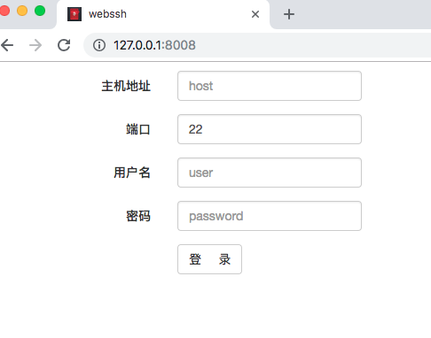
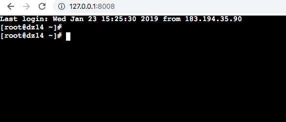
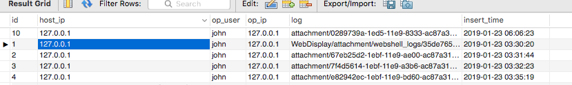

WebShell
本项目使用基于django的websocket技术， channel，与 后端服务器进行实时交互。

环境要求：

python 3.x 至少 > 3.5

channels  2.1.6

django 2.0.5

如果安装channels过程中，提示缺少Twist,
可点击这里下载Twist https://www.pythoncoding.cn/blog/attachment/Twisted-18.9.0.tar.bz2
手动安装。

数据库（可以使用其他数据库代替）
mysql 5.7

启动流程:

首先在数据库中（以mysql为例）创建web_shell 库

其次 python manage.py migrate

最后 python manage.py runserver

登录界面：

操作界面：

操作日志记录：

